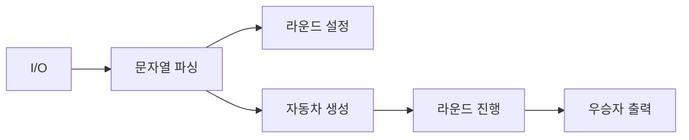
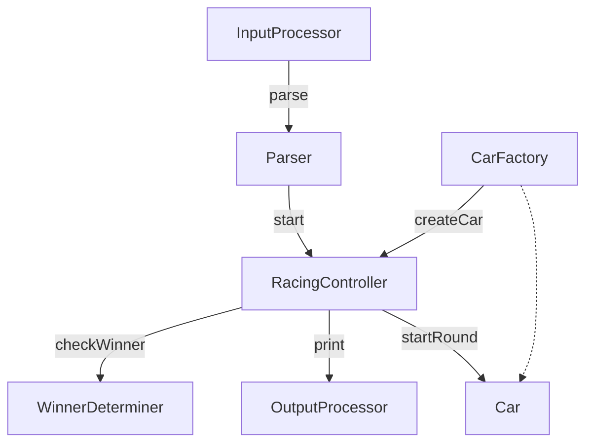

# 자동차 경주

자동차 경주는 n대의 자동차가 확률에 따라 전진하여 우승자를 출력하는 프로그램입니다. 전진 조건은 0과 9 사이의 무작위 값을 추출하여 4 이상일 경우 전진합니다.

## 구현 기능 목록

- [x] 사용자의 입력(자동차 목록, 라운드 수)을 받는다.
- [x] 입력 문자열을 파싱하여 자동차 목록 문자열 배열과 라운드 수를 추출한다.
- [x] 자동차 목록 문자열 배열을 기준으로 자동차 객체들을 생성한다.
- [x] 주어진 라운드 수 만큼 자동차들의 전진을 시도한다.
- [x] 매 라운드마다 현황판을 출력한다.
- [x] 모든 라운드가 끝난 후 가장 많이 전진한 자동차들을 선별한다.
- [x] 우승자 목록을 출력 양식에 맞게 출력한다.

## 프로젝트 구조

```
src
├── App.js
├── entities
│   ├── Car.js
│   ├── InputProcessor.js
│   ├── OutputProcessor.js
│   ├── Parser.js
│   ├── RacingController.js
│   └── WinnerDeterminer.js
├── data
│   ├── messages.js
│   └── regex.js
└── __tests__
    ├── ApplicationTest.js
    ├── CarTest.js
    ├── InputProcessorTest.js
    ├── OutputProcessorTest.js
    ├── ParserTest.js
    ├── RacingControllerTest.js
    └── WinnerDeterminerTest.js
```

## 주요 기능

### 자동차, 라운드 수 입력

- 사용자의 입력을 받는다.
- 입력 문자열을 파싱하여 자동차 목록 문자열 배열과 라운드 수를 추출한다.
- 자동차 목록 문자열 배열을 기준으로 자동차 객체들을 생성한다.
- 각 자동차 이름은 `1~5`자로 제한된다.
- 자동차 이름은 중복될 수 없다.
- 라운드 수는 `1` 이상의 양의 정수여야 한다.

### 자동차 전진

- 주어진 라운드 수 만큼 자동차들의 전진을 시도한다.
- 0~9 사이의 랜덤 정수를 추출하여 4 이상일 경우 자동차가 전진한다.
- 매 라운드마다 현황판을 출력한다.

### 우승자 선별

- 모든 라운드가 끝난 후 가장 많이 전진한 자동차들을 선별한다.
- 우승자 목록을 출력 양식에 맞게 출력한다.

### 에러 처리

잘못된 입력이 주어지면, `[ERROR]`로 시작하는 에러 메시지가 출력되고 프로그램이 종료됩니다.

## 설계

### 도메인 설계

아래 흐름은 입력부터 우승자 출력까지의 도메인 단계입니다.



- **I/O**: 사용자 입력 수집 및 출력(UI, 콘솔) 처리
- **문자열 파싱**: 자동차 이름 목록, 라운드 수 추출 및 검증
- **자동차 생성**: 파싱된 이름으로 차량 인스턴스 준비
- **라운드 설정/진행**: 설정된 횟수만큼 전진 시도 및 라운드별 현황 출력
- **우승자 출력**: 최종 최다 전진 차량 선별 후 출력

### 객체 책임 할당

책임 주도 설계 결과는 다음과 같습니다.



- **InputProcessor**: 사용자 입력 수집 (`cars`, `rounds`)
- **Parser**: 입력 파싱/검증 → `{ carNames: string[], roundCount: number }`
- **RacingController**: 경주 시작/라운드 진행/상태 수집/우승자 요청의 오케스트레이션
- **Car**: 랜덤 규칙에 따른 전진 상태 보유
- **OutputProcessor**: 라운드 현황/우승자 출력
- **WinnerDeterminer**: 최종 상태에서 최대 전진 차량 목록 계산
- **CarFactory (개념적)**: 차량 생성 책임 분리 대상. 현재 구현에서는 `RacingController.#createCars()`가 역할 수행

## 테스트

### Application

- **기능 테스트 (전체 플로우)**
  - 입력: 사용자 입력 `pobi,woni`, `1` + 랜덤 `[4, 3]`
  - 출력 포함: `pobi : -`, `woni : `, `최종 우승자 : pobi`
- **예외 테스트**
  - 입력: `pobi,javaji`
  - 결과: `[ERROR]`로 시작하는 예외 발생

### InputProcessor

- **자동차 목록과 라운드 수를 입력 받는다**
  - 입력: `[pobi,woni, 1]`
  - 반환: `{ carNames: 'pobi,woni', roundCount: '1' }`
- **예외 케이스**
  - 자동차 목록 공백 → 예외 발생
  - 라운드 수 공백 → 예외 발생

### Parser

- **parse: 자동차 목록과 라운드 수 파싱**
  - 입력: `('pobi,woni', '1')` → `{ carNames: ['pobi', 'woni'], roundCount: 1 }`
  - 입력: `('pobi', '99999999')` → `{ carNames: ['pobi'], roundCount: 99999999 }`
- **에러 케이스**
  - 자동차 이름 길이(1~5) 위반: 예) `['pobibi','woni']`, `['pobi.woni','jun']`, `['pobi','','woni']` → 예외 발생
  - 라운드 수가 1 이상의 양수 아님: `''`, `'a'`, `true`, `[2]`, `{ round: 2 }`, `() => 2`, `1.2`, `0`, `-1`, `1e2`, `NaN`, `null`, `undefined` → 예외 발생

### Car

- **자동차를 생성한다**
  - 입력: 이름 `pobi` → 초기 위치 0
- **자동차를 움직인다**
  - 입력: 랜덤 시퀀스 `[1,2,3,4,5,6,7,8,9]`
  - 결과: `위치 6 (4 이상 값의 개수만큼 전진)`

### OutputProcessor

- **자동차 경주 현황판을 출력한다**
  - 입력: `[['pobi',3], ['woni',2], ['jun',1]]`
  - 출력: `pobi : ---`, `woni : --`, `jun : -`
- **우승자를 출력한다**
  - 입력: `['pobi','woni']`
  - 출력: `최종 우승자 : pobi, woni`

### RacingController

- **자동차 경주를 시작한다 (라운드 진행 + 출력)**
  - 입력: 자동차 `['pobi','woni']`, 라운드 `3`, 랜덤 `[4,3,4,3,4,3]`
  - 출력 포함: `pobi : ---`, `woni : `, `최종 우승자 : pobi`

### WinnerDeterminer

- **우승자를 선별한다**
  - 입력: `[['pobi',4], ['woni',3], ['jun',4], ['lee',2], ['park',3], ['choi',4], ['cho',1], ['kim',2], ['jung',0]]`
  - 출력: `['pobi','jun','choi']`
